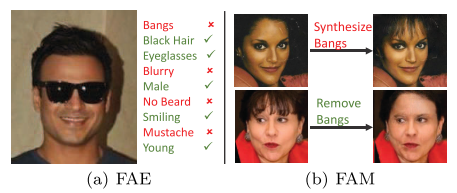
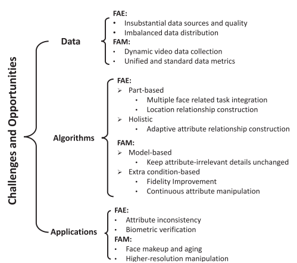
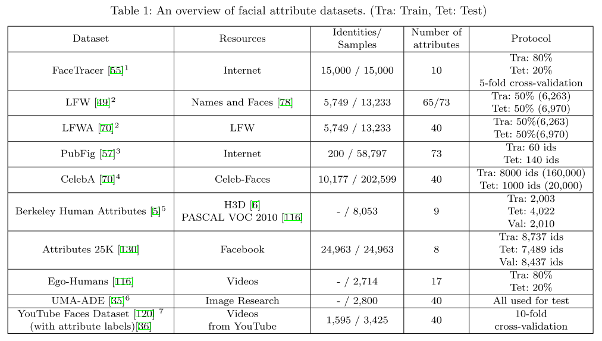

### 背景

**面部属性分析（FAA: facial attribute analysis)** 主要研究两大问题：
1. **面部属性估计（FAE: facial attribute estimation)** ：识别给定图片中是否包含某个属性。目前方法1: Part-based FAE, 先定位属性位置，然后提取特定位置特征，最后进行属性预测。目前方法2：holistic FAE，关注属性之间的关系，用一个整体网络估计各个属性。
2. **面部属性改造（FAM: facial attribute manipulation）**：生成/移除图片中特定属性。目前主要基于生成模型（GAN，VAE：variational autoencoders)。可分为：model-based methods 和 extra condition-based methods. 后者引入属性向量或参考图片作为条件输入，可以同时改变多个属性的状态。

FAE 和 FAM：

### FAA面临的挑战

#### FAE主要问题：
1. 数据集是基于名人、新闻的，非真实场景
2. 数据集不平衡
3. 缺乏自适应的属性划分框架（现在holistic FAE算法依赖于先验的人工属性划分）
4. 属性不一致问题。（同一个人不同图片属性标签可能不同）
#### FAM主要问题：
1. 数据标注难，训练数据少
2. 缺乏评价指标
3. 生成属性的连续性

**利用FAE和FAM的关系可以提升两者的性能**： FAM可以作为FAE的数据增强，FAE可以作为FAM的评价指标。

### 整体框架
#### 数据预处理
人脸检测（+人脸关键点检测） 和人脸对齐  
*近期趋势：将人脸检测和对齐和属性分析作为一个整体进行训练。*
#### 数据增强
训练集：旋转，平移，缩放，随机对折...
测试集：crop10张，分别预测取平均
#### FAE
早期：CNN提特征+传统分类器分类（SVM，KNN）。近期：直接使用CNN。loss（Eulidean loss 和 sigmoid crossentropy loss:两者性能相似。 把属性分类作为回归问题：MSE loss）
### 数据集、评价指标
数据集广泛使用的是：CelebA，LFW（LFWA）

评价指标：  
Acc, ER     
BAcc, BER(用于不平衡数据集)
**mean Average Precision(mAP)** 各个属性AP的均值。（广泛使用）
### state-of-art FAE算法
#### part-based FAE
*part-based deep FAE methods first locate the areas where facial attributes exist through localization mechanisms. Then, features corresponding to different attributes on each highlighted position can be extracted and further predicted with multiple at- tribute classifiers.*

**选取和属性相关位置的特征用于属性分类。**
**key:** 如何定位。
法1：定位和属性分类分离进行。eg: Poselet定位面部部位。PANDA网络预测属性。//面部语义分割——>属性分类。//根据landmark分割面部-->属性分类。//双通道：通道一输入GAN生成的包含位置信息的抽象人脸图。通道二输入真实人脸图[[paper]](chrome-extension://ikhdkkncnoglghljlkmcimlnlhkeamad/pdf-viewer/web/viewer.html?file=http%3A%2F%2Fwww.yugangjiang.info%2Fpublication%2F18IJCAI-FacialAttributes.pdf) [[code]](https://github.com/TencentYoutuResearch/FaceAttribute-FAN)。

法2：end-to-end定位。eg: LNet_定位人脸+ANet_提取特征+SVM_分类(与法1区别：网络包含LNet用于定位，不需要预处理的人脸定位和landmarks)。//FRL_定位+PaW_属性分类（每个属性有自己的定位网络FRL，因此网络比较臃肿）

**drawback:** 属性分类依赖于定位机制的精度。
#### Holistic Deep FAE
*holistic deep FAE meth- ods focus more on exploring the attribute relationships and extracting features from entire face images rather than facial parts.*

**key:** 前层网络共享学习通用特征，深层网络分离学习专属特征。
两大问题：1：

