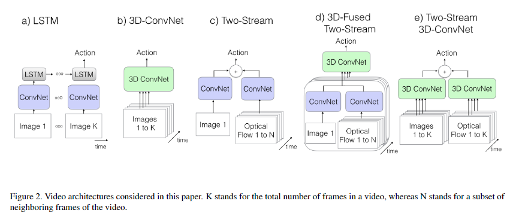

> [简译于blog](http://blog.qure.ai/notes/deep-learning-for-videos-action-recognition-review)

基于视频的行为检测，类似于基于三维医学图像的疾病检测。

两者均需结合一个二维序列的上下文信息得出推断。

---

## 1. 难点

+ 计算量大 （3D卷积结构参数量大，训练时间长 且 容易过拟合）

+ 远距离上下文信息的捕获 

+ 网络结构选择众多 （同一个网络同时捕获时空域信息 or 两个网络分别捕获时域信息和空域信息。多帧预测融合）

+ 缺乏标准benchmark （ UCF 101, Sports1M， 数据量有限，且模型泛化性不高。 Kinetics数据集的建立解决了该问题）

  难点方面，医学图像疾病检测 于 视频行为检测 **差异** ：

  1. 在一些疾病检测中，时序信息并不重要，甚至可以直接通过单帧判断患病情况。
  2. 基于视频的行为检测依赖于预训练模型，而医学疾病检测，通常没有可用的预训练模型。

---

## 2. 基础方法

传统方法思路：1. 提取局部特征（全图提取 or 关键点提取） 2. 视频级的特征编码（ 分层聚类 or k-means）3. SVM or RF分类。

深度学习算法：（根据 结合时空域信息的方法差异进行分类）

 **默认方法：一个视频被分为多个切片(clip)，每个切片有一个预测。多个切片的预测做平均得到最终的行为预测**。

1. **单分支网络**

   [work2014](https://research.google.com/pubs/archive/42455.pdf) 探索了多种融合连续帧中时序信息的方法。先用预训练的2D卷积网络提取每一帧特征。然后将这些特征作为输入，训练一个融合网络，分别尝试了在融合网络的开始，最后，中间逐步进行各帧信息的融合。最后由融合网络得到多帧的行为预测。 实验结果：明显差于传统算法。理由：2D卷积网络没有捕获运动特征 + 数据集不够

   

2. **二分支网络**

   [work2014](https://arxiv.org/pdf/1406.2199.pdf) 基于单分支网络，将空间信息和时间信息分为两个分支。空间分支的输入是单帧图像，时间分支的输入是10帧连续光流。两个分支单独训练，最终用SVM进行融合。实验结果：比1有提升，但仍存在一些问题。eg; 时空域分开独立训练。

   

**存在问题**：

+ 视频预测是基于切片预测的平均，因而长距离时域信息被丢失。
+ 切片是从视频中截取的片段，切片的标签直接使用了视频的标签，存在引入错误切片标签的问题。

---

## 3. 新兴算法

基于两种基础算法，出现一系列算法，它们的推进过程如下：

1. **LRCN**

   [Long-term Recurrent Convolutional Networks for Visual Recognition and Description (2014)](https://arxiv.org/abs/1411.4389)

   使用CNN提取单帧特征，使用LSTM得到多帧（16帧）预测，平均多帧预测得到切片预测，平均切片预测得到视频预测。分别尝试了 RGB输入 和 光流输入。实验结果：加权的RGB输入和光流输入 结果最优。 后有算法通过降低图像清晰度，增大切片长度（60帧），提升了结果。存在问题：切片标签错误问题+无法捕获长期信息+光流计算和后续训练分离。

   

2.  **C3D**

   [Learning Spatiotemporal Features with 3D Convolutional Networks (2014)](https://arxiv.org/pdf/1412.0767)

   基于单分支网络，使用3D卷积，在Sports1M上训练3D卷积网络，用该网络作为特征提取器，用于其他数据集的视频行为识别。

   同时期，factorized 3D conv networks(FstCN) 提出将3D卷积分解为空间2D卷积+时间1D卷积。

3. **Conv3D & Attention**

   [Describing Videos by Exploiting Temporal Structure (2015)](https://arxiv.org/abs/1502.08029)

   **关键**：使用3D CNN-RNN 编解码结构 + 使用attention机制获取全局上下文信息。

   与<u>LRCN</u>的区别：1. 传入LSTM的是 3DCNN特征和 stacked2DCNN的 拼接（concatenate)。并且2D和3D的CNN是预训练好的，而不是end-to-end训练。2. 对于最后各帧的输出加上权重（attention）。

4. **TwoStreamFusion**

   [Convolutional Two-Stream Network Fusion for Video Action Recognition (2016)](https://arxiv.org/abs/1604.06573)

   **关键**：基于远程loss的远程时域建模 + 多级别融合 （本文奠定了二分支法的主流地位）

   实验结果：在没有增加参数的前提下，提高了识别性能。  

   

   

5. **TSN**

   [Temporal Segment Networks: Towards Good Practices for Deep Action Recognition [2016]](https://arxiv.org/abs/1608.00859)

   **关键**：长期模型建模+BN，dropout, pre_training

   创新点：1. 在视频中采样离散的帧做为切片（更好地建立长期信息模型）2. 探索多种最终得到视频预测的方案，得到最优方案为： 如下图，平均法分别得到时域和空域scores; 加权融合时空域scores； softmax得到最终类别。

   

   本文尝试解决两大挑战：小数据集过拟合问题； 长期模型建模问题。未解决问题：光流需要提前计算问题。

6. **ActionVLAD**

   [ActionVLAD: Learning spatio-temporal aggregation for action classification (2017)](https://arxiv.org/pdf/1704.02895.pdf)

   **关键**：使用了可学习的特征聚合算法（VLAD）+ end-to-end 训练框架

   

7. **HiddenTwoStream**

   [Hidden Two-Stream Convolutional Networks for Action Recognition (2017)](https://arxiv.org/abs/1704.00389)

   **关键**：动态生成光流 （提升了网络速度，减轻了之前算法缓慢的光流计算问题）

   使用无监督的方法生成帧对应的光流。光流生成可以看做一个图像重构问题。即：使用相邻两帧图像可以得到光流，使用光流和某一帧图像可以重构另一帧图像。

   和基本二分支网络区别：1. 在时域CNN前加入提取光流的网络MotionNet, 因而时域输入从光流变成了多帧图。2. 增加了用于无监督训练MotionNet的multi-level loss。

   

8. **I3D**

   [Quo Vadis, Action Recognition? A New Model and the Kinetics Dataset (2017)](https://arxiv.org/abs/1705.07750)

   **关键**：结合3D模型与二分支框架的预训练思想 + kinetics 数据集

   论文证明了使用2D预训练模型对结果的巨大影响。通过堆积多个相同的预训练2D模型，得到3D模型，提取多帧特征。实验结果：使用预训练可以提升近5个百分点。

9. **T3D**

   [Temporal 3D ConvNets: New Architecture and Transfer Learning for Video (2017)](https://arxiv.org/abs/1711.08200)

   **关键**：有监督的迁移学习

   本文基于I3D，提出使用单分支的3D DenseNet based architecture替代双分支网络。

   

   有监督迁移学习：用2D预训练模型和video,clip匹配标签，来训练3D的T3D网络参数。

   

   

