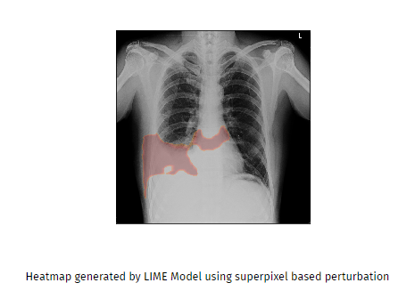
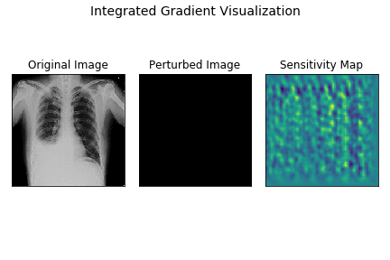

> [引于blog1](http://blog.qure.ai/notes/visualizing_deep_learning), [blog2](http://blog.qure.ai/notes/deep-learning-visualization-gradient-based-methods)

模型可视化有两种思路：

## 1. 基于扰动

+ 给图像加噪声（或mask），看模型输出的变化。 导致输出变化越大的区域越重要（确定关键区域）

  

+ 选择部分特征，赋随机值，看模型输出变化。（确定关键特征）

+ 超像素扰动法 （常规方格扰动存在问题：当关键部位被部分遮挡时，可能造成异常输出，导致由其确定的关键区域可能并不准确）。 超像素：由值接近的一组相邻像素组成的机会。超像素扰动法具体如下：

  + 将图像分解为n个超像素集合（S1, S2,...,Sn)
  + 生成k个样本：1. 随机激活一些超像素集合，激活表示保持该集合中像素值为初始像素值。2. 对于未激活的超像素集合，用其像素均值替代集合内所有像素。
  + 得到每个样本的患病预测值 (P1, P2,....,Pk)
  + 拟合出 超像素集合 （S1, S2,...,Sn）与 患病预测P直接的关系。（eg: 第i个超像素集合是激活状态，则Si=1，否则Si=0， k个样本能得到k个方程，最终求解出P=a1\*S1+a2\*S2+....+an\*Sn）
  + 使用超像素集合Si对应的权重ai生成热图。（即权重大的超像素集合，对应的热图值大）

**存在问题**：1. 计算复杂。2. 常规区域扰动和超像素扰动都可能会导致预测值异常。比如：在X光片疾病检测中，通常在任意位置的阴影或者器官扩张都反映病患。如果使用扰动法，将直接引入黑块或阴影，不管扰动区域在哪个部位，都导致预测直接倾向于患病。

+ **改进方法**: 扰动结合导数。让图像取从0开始递增的连续域值，分别得到预测。通过每个像素值对结果预测的影响，得到每个像素对应的敏感度，最后由敏感度得到热图。具体如下：

  + 对应每个像素X(ij)取0~X(ij)范围内的k个值得到k个样本
  + 计算预测P对扰动值的导数作为敏感度
  + 结合k个样本的敏感度值，得到最终的热图值

  
  
  可以看出当图像越接近原图时，对应的热图越能反映关键区域。（:thinking: 为什么不直接用原图求导数？​）
  
  

## 2. 基于反向传播

+ 基于导数算法： 用输出对应输入的导数构建热图，
+ 基于相关值的算法： 反向传播概率值到输入

