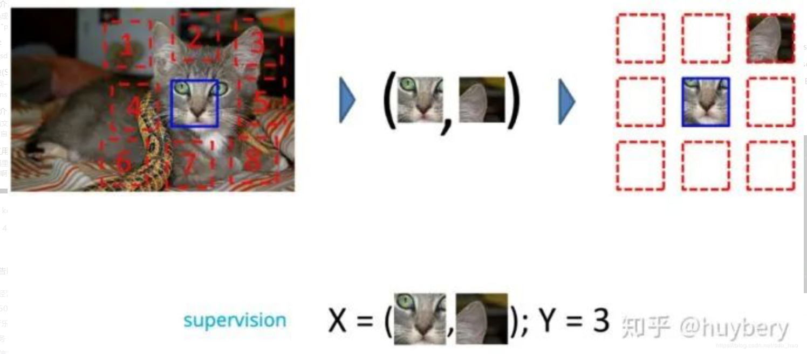

## 半监督算法

[总结blog](https://zhen8838.github.io/2020/02/04/ssl-mixmatch/#more)

## 无监督，自监督，半监督，监督，强化

**监督学习**利用大量的标注数据来训练模型，模型的预测和数据的真实标签产生损失后进行反向传播（计算梯度、更新参数），通过不断的学习，最终可以获得识别新样本的能力。

**无监督学习**不依赖任何标签值，通过对数据内在特征的挖掘，找到样本间的关系，比如聚类相关的任务。

*真正的无监督学习应该不需要任何标注信息，通过挖掘数据本身蕴含的结构或特征，开完成相关任务，大体可以包含三类：1）聚类(k-means，谱聚类等) 2）降维（线性降维：PCA、ICA、LDA、CCA等；非线性降维：ISOMAP、KernelPCA等；2D降维：2D-PCA）3）离散点检测（比如基于高斯分布或多元高斯分布的异常检测算法）*

**自监督学习**主要是利用辅助任务（pretext）从大规模的无监督数据中挖掘自身的监督信息，通过这种构造的监督信息对网络进行训练，从而可以学习到对下游任务有价值的表征。**目标是学习出有效的特征表示**（也就是说自监督学习的监督信息不是人工标注的，而是算法在大规模无监督数据中自动构造监督信息，来进行监督学习或训练。因此，大多数时候，我们称之为无监督预训练方法或无监督学习方法，严格上讲，他应该叫自监督学习）

半监督学习：

## 自监督学习

[关于自监督非常好的总结blog](https://blog.csdn.net/sdu_hao/article/details/104515917)

**自编码器个人认为可以算作无监督学习，也可以算作自监督学习，个人更倾向于后者。不过原文作者把自编码器看作是无监督学习方法，并将其与自监督学习方法相区分，具体区别如上文所示：自编码器，可能仅仅是做了维度的降低而已，而自监督学习的目的不仅仅是维度更低，还可以包含更多的语义特征**

对于自监督学习来说，存在三个挑战：

1. 对于大量的无标签数据，如何进行表征/表示学习？
2. 从数据的本身出发，如何设计有效的辅助任务 pretext？
3. 对于自监督学习到的表征，如何来评测它的有效性？( Pretrain-Fintune 的模式)

### 自监督的主要方法：

#### 1. 基于上下文（Context Based）

基于数据本身的上下文信息，我们其实可以构造很多任务，比如在 NLP 领域中最重要的算法 Word2vec 。Word2vec 主要是利用语句的顺序，例如 CBOW 通过前后的词来预测中间的词，而 Skip-Gram 通过中间的词来预测前后的词。而在图像中，研究人员通过一种名为 Jigsaw（**拼图**）[7] 的方式来构造辅助任务。我们可以将一张图分成 9 个部分，然后通过预测这几个部分的相对位置来产生损失。比如我们输入这张图中的小猫的眼睛和右耳朵，期待让模型学习到猫的右耳朵是在脸部的右上方的，如果模型能很好的完成这个任务，那么我们就可以认为模型学习到的表征是具有语义信息的

除了这种拼图的模式，还有一种是**抠图**[9]。想法其实也很简单粗暴，就是我们随机的将图片中的一部分删掉，然后利用剩余的部分来预测扣掉的部分，只有模型真正读懂了这张图所代表的含义，才能有效的进行补全。

还有一种思路是通过图片的**颜色信息**[11]，比如给模型输入图像的灰度图，来预测图片的色彩。只有模型可以理解图片中的语义信息才能得知哪些部分应该上怎样的颜色，比如天空是蓝色的，草地是绿色的，只有模型从海量的数据中学习到了这些语义概念，才能得知物体的具体颜色信息。同时这个模型在训练结束后就可以做这种图片上色的任务。

最后我们要介绍的是根据类似**数据增广**的方式来寻找自监督上下文。ICLR 2018 [13]的工作是给定一张输入的图片，我们对其进行不同角度的旋转，模型的目的是预测该图片的旋转角度。这种朴素的想法最后带来的增益竟然是非常巨大的，所以数据增强对于自监督学习也是非常有益处的，我个人的想法是数据增强不仅带来了更多的数据，还增加了预训练模型的鲁棒性。

我们之前介绍的模型都是在专注如何寻找自监督信息，而自监督学习一定要脱离下游的具体任务吗？答案是否定的，越来越多的工作开始思考**自监督学习和具体任务紧密结合的方法**(Task Related Self-Supervised Learning)。

Lee, Hankook et al [14]探索了在多任务学习中增加自监督学习的可能，他们将普通的分类任务中嵌入了旋转预测任务。除了简单的多任务学习，也可以设计联合学习策略，直接预测两种监督信息。

而自监督和半监督学习（大量数据没有标签，少量数据有标签）[16]也可以进行结合，对于无标记的数据进行自监督学习（旋转预测），和对于有标记数据，在进行自监督学习的同时利用联合训练的想法进行有监督学习。

#### 2. 基于时序（Temporal Based）

之前介绍的方法大多是基于样本自身的信息，比如旋转、色彩、裁剪等。而**样本间其实也是具有很多约束关系的**，这里我们来介绍利用时序约束来进行自监督学习的方法。最能体现时序的数据类型就是视频了（video）。

第一种思想是基于帧的相似性[17]，对于视频中的每一帧，其实存在着特征相似的概念，简单来说我们可以认为视频中的**相邻帧特征**是相似的，而相隔较远的视频帧是不相似的，通过构建这种相似（position）和不相似（negative）的样本来进行自监督约束。

另外，对于同一个物体的拍摄是可能存在多个**视角**（multi-view），对于多个视角中的同一帧，可以认为特征是相似的，对于不同帧可以认为是不相似的。

还有一种想法是来自 @Xiaolong Wang 大佬 ICCV 2015 [18]的基于无监督追踪方法，首先在大量的无标签视频中进行无监督追踪，获取大量的物体追踪框。那么对于一个**物体**追踪框在不同帧的特征应该是相似的（positive），而对于不同物体的追踪框中的特征应该是不相似的（negative）。

除了基于特征相似性外，视频的**先后顺序**也是一种自监督信息。比如ECCV 2016, Misra, I. [19] 等人提出基于顺序约束的方法，可以从视频中采样出正确的视频序列和不正确的视频序列，构造成正负样本对然后进行训练。简而言之，就是设计一个模型，来判断当前的视频序列是否是正确的顺序。

#### 3. [基于对比（Contrastive Based）](https://ankeshanand.com/blog/2020/01/26/contrative-self-supervised-learning.html)

通过学习对两个事物的相似或不相似进行编码来构建表征，这类方法的性能目前来说是非常强的，从最近的热度就可以看出，很多大牛的精力都放在这个方向上面。关于这个方向的方法，[22] 总结的比较好

通过构建正样本（positive）和负样本（negative），然后度量正负样本的距离来实现自监督学习。核心思想样本和正样本之间的距离远远大于样本和负样本之间的距离

我们首先介绍 ICLR 2019 的 DIM [23]，DIM 的具体思想是对于隐层的表达，我们可以拥有全局的特征（编码器最终的输出）和局部特征（编码器中间层的特征），模型需要分类**全局特征和局部特征是否来自同一图像**。所以这里 x 是来自一幅图像的全局特征，正样本是该图像的局部特征，而负样本是其他图像的局部特征。这个工作的开创性很强，已经被应用到了其他领域，比如 graph [24]。

CPC 同样是一个基于对比约束的自监督框架，主要是可以应用于能够以有序序列表示的任何形式的数据:文本、语音、视频、甚至图像（*图像可以被视为像素或块的序列*，后面作者也给出了具体的想法）。CPC 主要是利用自回归的想法，对相隔多个时间步长的数据点之间共享的信息进行编码来学习表示，这个表示 c_t 可以代表融合了过去的信息，而正样本就是这段序列 t 时刻后的输入，负样本是从其他序列中随机采样出的样本。CPC的主要思想就是**基于过去的信息预测的未来数据**，通过采样的方式进行训练。

对于具体的实现上，因为存在大量的样本，如何存取和**高效的计算**损失是急需解决的。研究人员提出了memory bank [27]的概念，也就是说我们把之前模型产生样本特征全部存起来，当前计算损失的时候直接拿来用就可以了，每次模型更新完后将当前的特征重新更新到 memory bank 中，以便下一次使用。这个工作的缺点就在于每次需要将所有样本的特征全部存起来。后续 kaiming 大神提出的 Moco[28]， 主要的贡献是 Momentum Update、 shuffleBN 等技术点来优化这个过程。

最近 hinton 组又放出了 SimCLR[29]，这个工作主要是对于一个输入的样本，进行不同的**数据增广**方式，对于同一个样本的不同增广是正样本，对于不同样本的增广是负样本。整个过程比之前kaiming提出的动量对比（MoCo）更加的简单，同时省去了数据存储队列。这个工作的创新主要有两个：

1. 在表征层和最后的损失层增加了一个非线性映射可以增加性能 （这个地方我比较好奇，希望能有大佬给出更直观的解释）。
2. 数据增广对于自监督学习是有益的，不同数据增广方式的结合比单一增广更好。同时作者公布了非常多的实验经验/技巧，比如自监督学习需要更大的 batch 和更长的训练时间。

----

## 半监督学习

