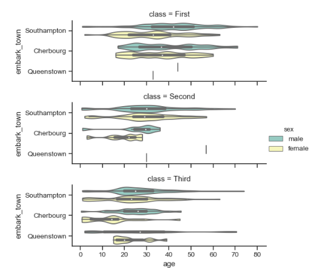

## [seaborn](https://seaborn.pydata.org/)

基于pandas的DataFrame. 可以以 柱状图，散点图，箱图，琴图等各种形式展示数据分布。支持多个维度数据的综合分析，以及多种图的组合展示。

常用函数：

1. pairplot(): 散点图画出df每两个column之间的分布图，直方图/高斯曲线画出每个column的分布。

   pairplot(....., plot_kws=dict(scatter_kws=dict(s=6)), height=5): 设置散点图中散点size，图像size。

```
import seaborn as sns; sns.set(style="ticks", color_codes=True)
>>> iris = sns.load_dataset("iris")
>>> g = sns.pairplot(iris)
```


2. jointplot(): 指定两个column，画出两者对应的散点分布和各自的直方图

```python
g = sns.jointplot("total_bill", "tip", data=tips, kind="reg")
```


3. catplot(): 展示数据在某两个column上的分布。

   ```python
   g = sns.catplot(x="age", y="embark_town",
   ...                 hue="sex", row="class",
   ...                 data=titanic[titanic.embark_town.notnull()],
   ...                 orient="h", height=2, aspect=3, palette="Set3",
   ...                 kind="violin", dodge=True, cut=0, bw=.2)
   ```




~~~python
plt.figure(figsize=(20,20))
g = sns.catplot(y='city_prov', hue='label', col='sex', data=sumdata, kind='count', height=20, aspect=0.6)
plt.savefig('duanyu_in_province_bysex.jpg')
plt.show()
~~~

