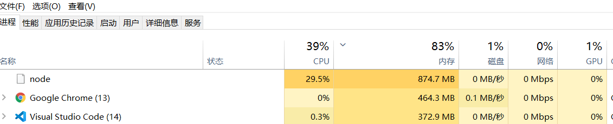
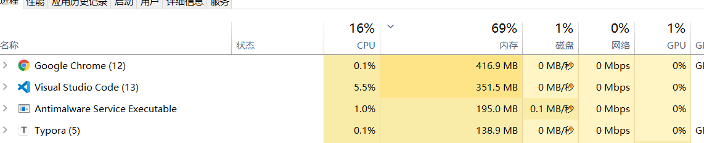
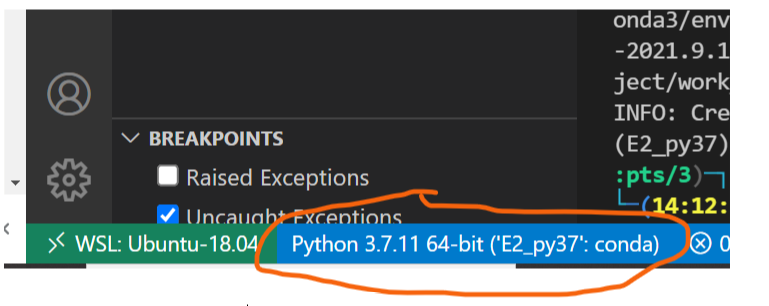

## 远程服务器上Python调试：

[**go to defination失败问题**](https://blog.csdn.net/xrinosvip/article/details/88785076)

**原因**：没有Python扩展

**解决**：

1. 修改 .vscode-server权限为可读写   chmod -R 777 .vscode-server （没有权限可能导致扩展安装失败）

2. 左边工具栏， 安装Python扩展
3. 重启vscode.

## vscode + WSL 占用内存大

使用vscode+WSL时，出现一个 node进程，占用内存十分大，内存占用值会不断缓慢增加，甚至可能增加到2G。

**失败尝试：**

1. "search.followSymlinks": true ----> false  (知乎解答)，该方法可以使得关闭vscode后node进程结束，但只要开启vscode，node进程对应内存又会继续增加。
2. 更换vscode版本

**真实原因：workspace对应目录里文件太多，vscode/WLS会加载workspace里的所有文件，导致内存占用极大。**

**成功解决方案：**更换vscode的工作目录到当前project对应的文件夹（只含有本project需要文件），node进程内存占用会迅速下降到很低值。

改进后：node已经不会出现在前几个资源占用进程

 

## vscode 使用 虚拟环境 debug

source activate ENV 可以切换到虚拟环境ENV中运行 Python xxx.py。但即使切换后，如果进行debug， 仍然用的默认python 环境。

如果想修改 debug 对应的Python环境 （也就是修改vscode默认的环境）：点击左下方 可以直接选择环境进行切换 （如果失败，`Ctrl`+`Shift`+`P` 输入`Python：select interpreter`）

