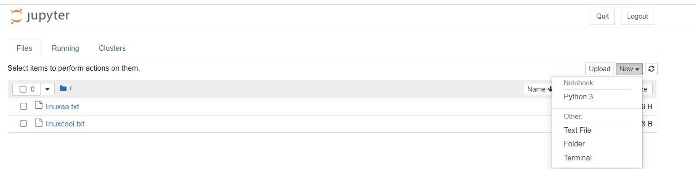
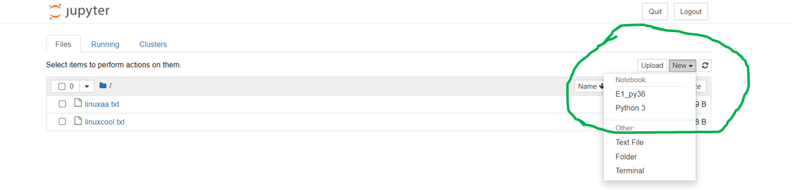
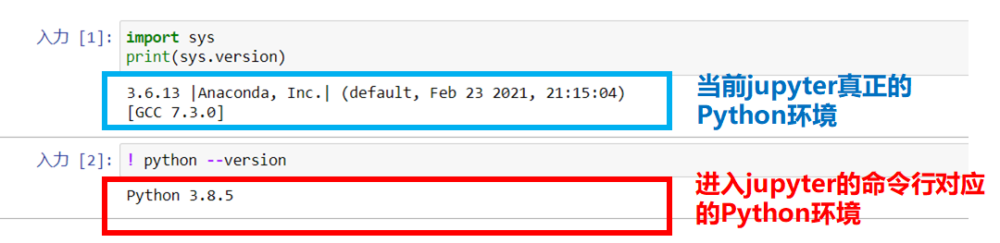

## jupyter 远程连接服务器

参考 [简书](https://www.jianshu.com/p/8fc3cd032d3c)

### 方法1. ssh远程使用jupyter notebook

1. 在远程服务器上，启动jupyter notebooks服务：

```undefined
jupyter notebook --no-browser --port=8889
```

1. 在本地终端中启动SSH：

```css
ssh -N -f -L localhost:8888:localhost:8889 username@serverIP
```

其中： -N 告诉SSH没有命令要被远程执行； -f 告诉SSH在后台执行； -L 是指定port forwarding的配置，远端端口是8889，本地的端口号的8888。

> 注意：username@serverIP替换成服务器的对应账号。

1. 最后打开浏览器，访问：http://localhost:8888/

### 方法2. 利用jupyter notebook自带的远程访问功能

官方指南在此：[官方指南](http://jupyter-notebook.readthedocs.io/en/latest/public_server.html#notebook-server-security)

1. 生成默认配置文件
    `jupyter notebook --generate-config`
2. 生成访问密码(token)
    终端输入`ipython`，设置你自己的jupyter访问密码，注意复制输出的`sha1:xxxxxxxx`密码串

```python
In [1]: from notebook.auth import passwd
In [2]: passwd()
Enter password:
Verify password:
Out[2]: 'sha1:xxxxxxxxxxxxxxxxx'
```

3. 修改`./jupyter/jupyter_notebook_config.py`中对应行如下

```python
c.NotebookApp.ip='*'
c.NotebookApp.password = u'sha:ce...刚才复制的那个密文'
c.NotebookApp.open_browser = False
c.NotebookApp.port =8888 #可自行指定一个端口, 访问时使用该端口
```

4. 在服务器上启动`jupyter notebook`
    `jupyter notebook`

5. 最后打开浏览器，访问：http://ip:8888/


## jupyter使用conda虚拟环境

参考 [英文帖子](https://medium.com/analytics-vidhya/create-virtual-environment-using-conda-and-add-it-to-jupyter-notebook-d319a81dfd1)

1. 配置虚拟环境

```python
## conda 创建虚拟环境
conda create -n <env_name>  # eg: conda create -n py36_env python=3.6
conda env create if env.yml  # 根据yml配置文件生成虚拟环境
## conda 激活环境
conda activate <env_name>
## conda 查看所在环境
conda env list  //  conda info -e   //  conda info --env
## 退出当前环境
conda deactivate
## 删除虚拟环境
conda env remove -n <env_name>
```

2. 将虚拟环境加入jupyter notebook 
   
   加入前：

   
   

加入后：

   

   - 切换到虚拟环境 py36_env中，安装ipykernel到该环境中：
      `pip install --user ipykernel`
   - 将py36_env加入jupyter：
      `python -m ipykernel install --user --name=py36_env`
   - 确认kernel.json已经更新（可选）： cd 到env目录下，查看配置文件kernel.json


>   2_add. jupyter报错： **500： Internal server error**
>
>   - **切换到 base 环境中**：
>   `pip install --upgrade --user nbconvert` (如果还是报错500，说明当前nbconvert版本仍有问题，强制安装特定版本：`pip install nbconvert==5.6.1`)

3. 删除jupyter中的虚拟环境：

   - 查看当前jupyter中kernel可用的虚拟环境：
   `jupyter kernelspec list`

   - 删除某个虚拟环境的kernel：
   `jupyter kernelspec uninstall <env_name>`


### 注意：

- 可以在 `kernel` --> ` Change kernel`里切换jupyter的运行环境

- jupyter中 `! conda info -e` 或 `! python --version`等以`!`开头的shell操作，其实是在进入jupyter notebook的环境中进行的，并不能代表当前jupyter的运行环境！查看当前python环境应该用：

```python
import sys
print(sys.version)
```

