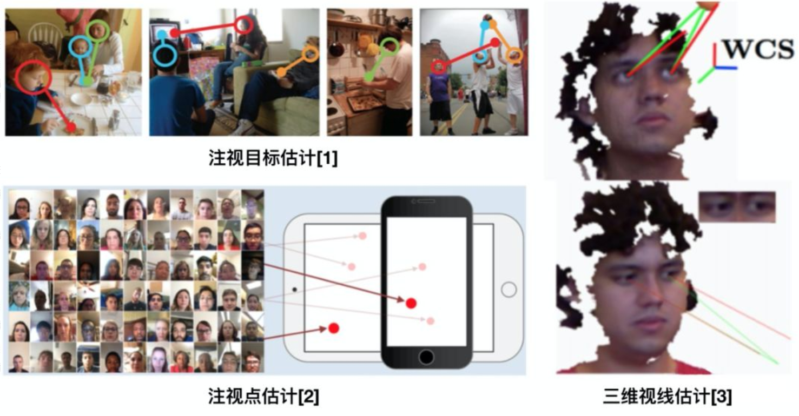
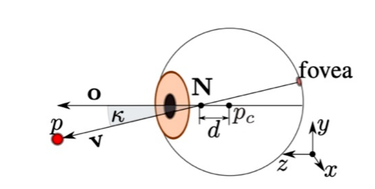

## K-Means(K均值)聚类

基础知识：

注视点估计、注视目标估计gaze following以及三维视线估计

**三维视线估计（个性化问题）**

直觉上来说，视线 v 应该就是瞳孔中心与眼球中心的连线。然而事实上，视线 p 是连接 fovea 与 N 的直线，它与我们通常认为的“视线”，即 optical axis 不同。

我们用 k 来表示视线 p 与 optical axis 的夹角，k 的大小因人而异，由人眼球内部参数决定，无法从图像中学习获得
仅有少量校准样本的情况下，如何进行有效的个性化视线估计

经典论文：

Learning-by-Synthesis for Appearance-based 3D Gaze Estimation （CVPR2014）

