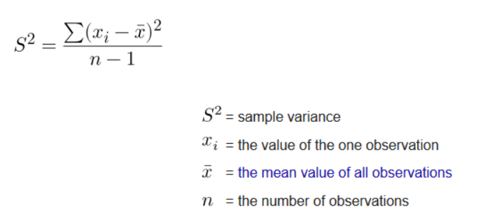

## **df.iloc VS df.loc** 

df.iloc[1:3, :]  : 取第1行~第2行 （不包含第3行）   .iloc按位置取切片，操作和list切片操作一致，取左不取右

df.loc[1:3, :] ：取index=1,2,3的行 （包含index=3的行）   .loc表示按index的**内容**去取！！！ 左右都取


## **pd.concat(),  df.append(), df.loc[i]  VS  np.append()   VS   ls.append() 速度问题**

numpy 不支持动态扩展！！！ 每次进行append 会重新分配内存，复制原来的array过来。因此 多次进行append的时候会很慢，越append越慢，非常慢！！

pandas存在和numpy同样的问题！但实际比numpy会快一些（why?) ，即使如此也非常慢！

**当要进行多次append的时候，请使用list， 支持动态扩展，速度很快！**

三者运行时长： numpy >> pandas >> list  （相差非常多！ 百倍）

**numpy适合矩阵运算**，numpy的广播矩阵运算会远远快于lIst的嵌套for循环（百倍）


## df.var()  VS  numpy.var()

**df.var()：**求的是无偏估计的方差




**numpy.var()：**求的是数据本身的方差，np.dot(x-x.mean(),x-x.mean())/N ，注意分母是N不是N-1

```python
df = pd.DataFrame(np.random.rand(5,3), columns=['a','b','c'])

df.var()   ## pandas的dataframe的var()函数，返回每列(或每行，axis=1)对应的无偏方差
## output: 
# a 0.07313
# b 0.16643
# c 0.08079

df.values.var() ## numpy的arrary的var()函数，返回整个矩阵对应的方差
# 0.08598

df.a.var()
# 0.07313xxxx
df.a.values.var()  ## a列，用numpy求方差，计算时分母为N (pandas的var为N-1)
# 0.05851         注： 0.05851*5/4 = 0.07313xx

## 当df只有一行数据时：
df = pd.DataFrame(np.random.rand(1,3), columns=['a','b','c'])
df.a.var()  ## 无偏方差为None
# NaN
df.a.values.var()  ## 方差为 0
# 0.0
```

